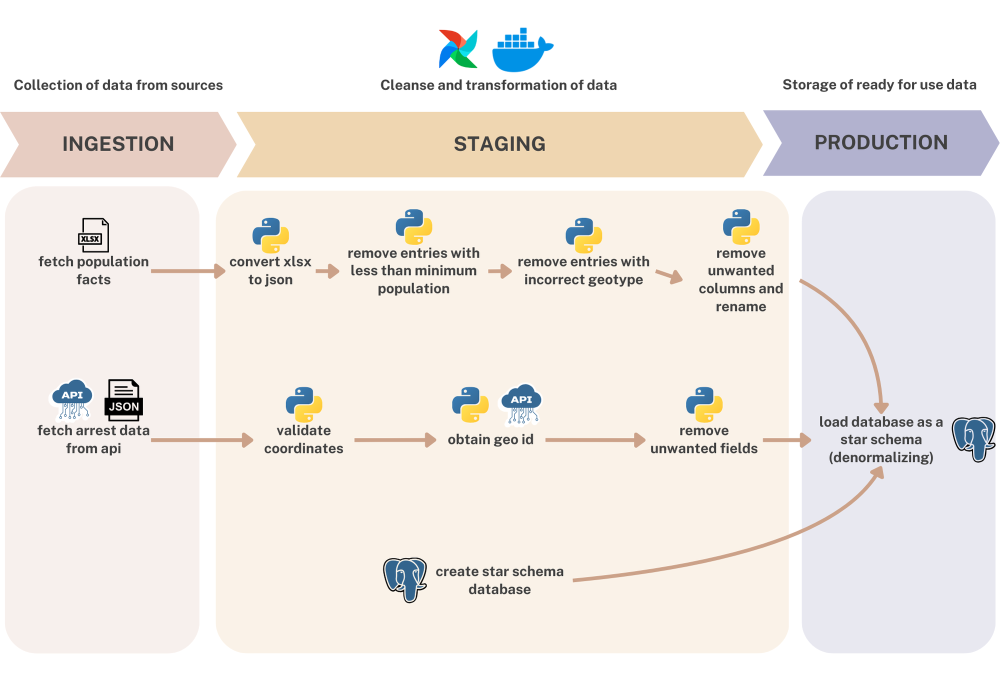

# Analyzing Arrests and Demographics: A Data Pipeline Approach in NYC

**Authors**: Irvin Cote, Marta Toca Carballo  
**Date**: 15th January 2025  
**Subject**: Foundation of Data Engineering, INSA Lyon

---

## Abstract

This project focuses on building a data pipeline to analyze the relationship between arrests in New York City and the demographic characteristics of the areas where they occur. By integrating arrest records, geospatial data, and census statistics, we aim to provide insights into patterns of arrests and their correlation with population demographics. The final result is a star schema that supports analytical queries on this integrated dataset.

---

## How to setup the project

To get the project up and running execute the two following commands

```
docker build -t airflow-image-toca-cote:latest .
docker compose up

```

---

## Online/Offline switch

To project has a switch to allow for offline execution.
This switch is a boolean variable named 'is_offline' and is located in the file nyc_arrests_and_pop_facts.py

If the variable is set to False, the data fetching tasks will fetch the data from the internet, while if it is set to True the tasks will use backup data stored in the repository under the directory named 'offline data'.

---

## Project Description

Arrest records in NYC provide valuable insights into law enforcement trends, but they lack contextual demographic data, which is critical for deeper analysis. This project bridges the gap by combining arrest records with census tract-level demographic data, enabling analyses such as the distribution of arrests across different demographic groups and the temporal evolution of arrests in specific areas.

The data pipeline is designed to ingest, process, and store the data in a structured format, providing a foundation for further analysis.

---

## Project Goal

The primary goal of this project is to construct a star schema data warehouse to answer analytical questions such as:

- How do arrest rates evolve over time in different demographic areas?  
- Which census tracts have the highest arrest counts, and what are their population profiles?
- What types of arrests are more common in different areas?

---

## Requirements

### Tools and Technologies

- **Programming Language**: Python  
- **Data Storage**: PostgreSQL  
- **APIs Used**:
  - NYC Arrest Data API
  - Census Geocoder API for tract lookup
  - Census Demographics API for population statistics  
- **ETL Framework**: Apache Airflow
- **Visualization**: Jupyter notebook

### Software and Libraries

- `pandas` for data manipulation  
- `requests` for API integration  
- `geopandas` for geospatial operations  
- `sqlalchemy` for database interactions  
- `matplotlib` and `seaborn` for exploratory analysis  

---

## Data Pipeline



The pipeline is divided into three key stages: ingestion, staging, and production.

### 1. Ingestion

- **Sources**: Arrest data is ingested from the NYC Open Data API (json) and opulation demographics from the census 2020 (xlsx).

### 2. Staging

- **Arrest data**: Arrest records are cleaned for inconsistencies, such as missing or invalid coordinates. Then we obtain its geoid from census geocoder and unwanted fields are removed.  
- **Population facts**: The demographics are converted to json, entries with less than minimum the population (less than 94 according to NYC census data) are removed, entries with different geotype are removed (boroughs, localities that are not census tracts) and unwanted columns are removed and renamed. 

### 3. Production

- **Star Schema Design**:  
  - **Fact Table**: Contains arrest data, joined by geoid.  
  - **Dimension Tables**: Include demographic information (e.g., race, age groups, and population), time, type of arrest, offender.  
- **Storage**: Data is stored in a PostgreSQL database to allow efficient querying.  

---

## Difficulties

1. **Data Quality**: Arrest records occasionally include missing or inaccurate coordinates, requiring additional cleaning steps.  
2. **API Limitations**: The Census Geocoder API has rate limits, necessitating batching and throttling. 
3. **Time Constraints**: Processing large volumes of data required parallelization to meet deadlines.
4. **Choosing a Topic**: Selecting a topic that was both engaging and useful was a significant challenge. Initially, we aimed to explore a subject that would both interest us and have practical applications. However, the topic kept evolving, which led to some frustration and as the project progressed and time became a constraint, we had to accept these changes despite not being entirely satisfied with the direction it took.
5. **Handling Large Arrest Data**: One of the main technical hurdles we faced was dealing with the large volume of arrest data. Our computers struggled with the amount of data, and processing large datasets led to frequent system slowdowns and crashes. Specifically, when trying to compare arrests over time, we couldn't retrieve initial results because the data was too heavy for our systems to handle all at once. Solution: To address this, we developed a workaround by implementing a loop that allowed us to process smaller chunks of data at a time—retrieving only three arrests per day, which would give us up to 900 arrests. While this approach was more feasible, it significantly increased the processing time.

---

## Outcomes

- A fully functional data pipeline capable of ingesting and processing arrest and demographic data in NYC.  
- A star schema stored in PostgreSQL, supporting queries about arrest patterns and demographic profiles. 

---

## Future Work

1. **Scalability**: Expand the pipeline to include other cities or states.  
2. **Visualization**: Create interactive dashboards or maps for easier exploration of the data. 

---
